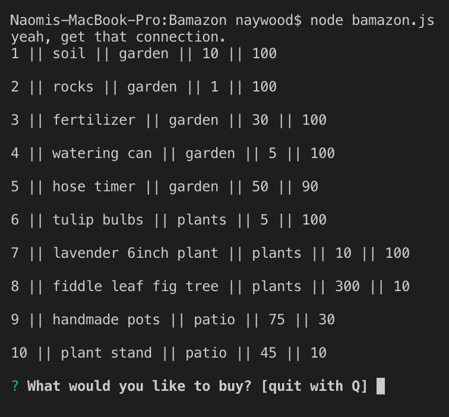
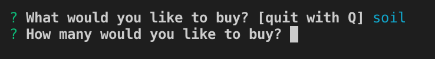
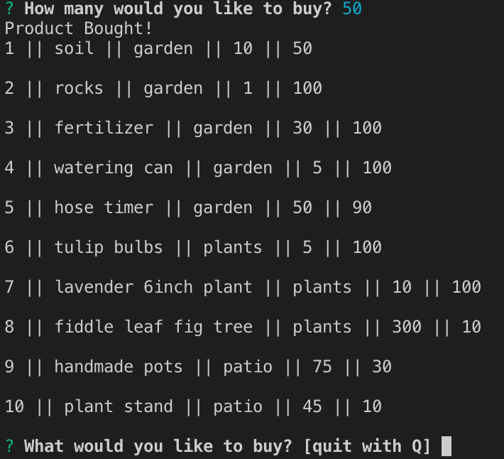
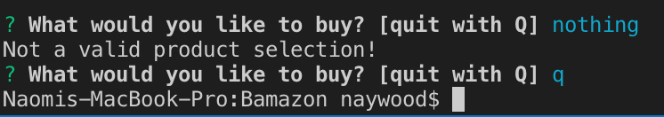

# Bamazon
Fake Amazon using MySQL, Node, Inquirer, and JavaScript. This version "sells" gardening/plant supplies. This app makes a simple command line based storefront.
 
## To run
* git clone https://github.com/naywood/Bamazon.git
* cd bamazon
* npm install
* node bamazon.js
 
## What it looks like
Now that you've followed the steps above, this is what you should get...
 
 
## all items in the store are displayed with item name, department, price and quantity available and then prompted to purchase or quit.

 
 
## Type a product name. The example here is soil. Then you're asked what quantity you'd like to purchase

 
 
## Type the amount you'd like to purchase and then the quantity is subracted from the total and displayed again

 
 
## At the end of your purchase, you can purchase something else. If the item does not exist, you will be prompted to purchase something again, or you have the option to quit.

